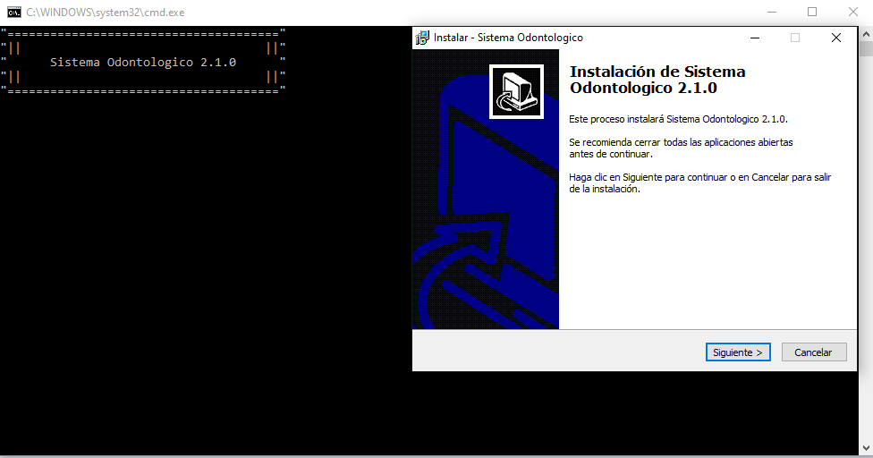
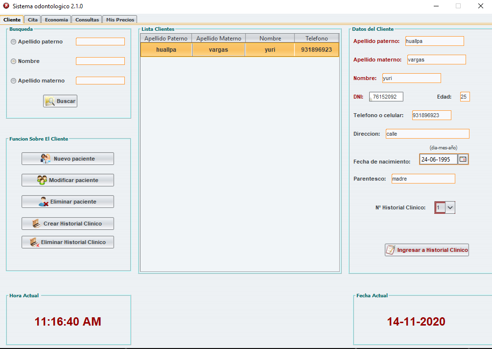
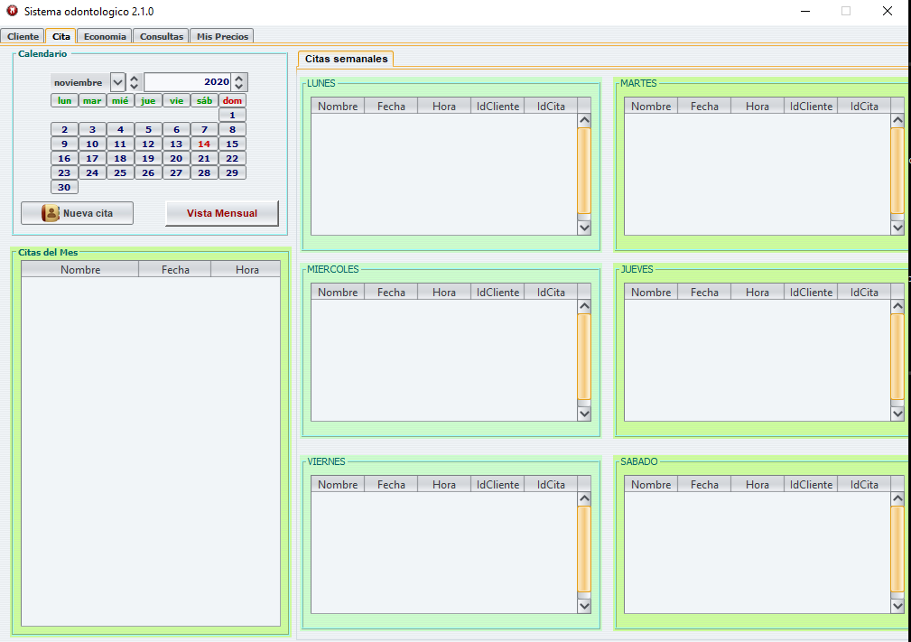
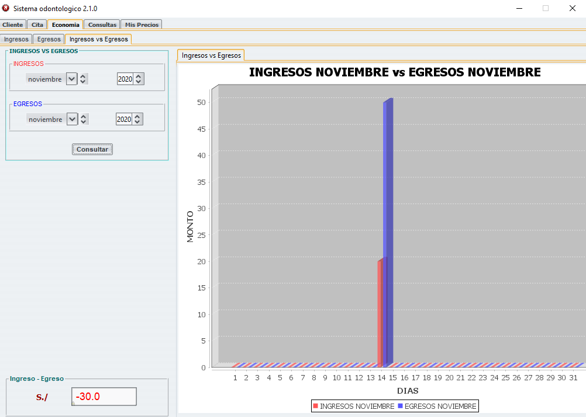
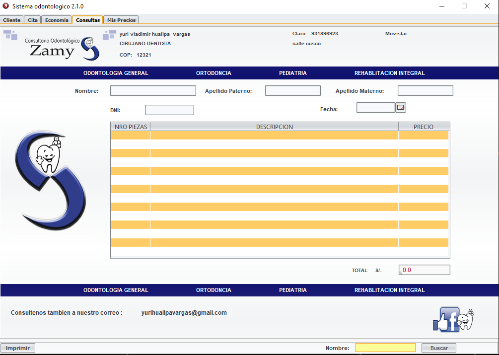

# Sistema odontologico
Se desarrolla un sistema de escritorio para una clinica. El sistema pose opciones de registro, registro de pacientes, historial, tratamientos, odonograma, citas, ingresos, egresos, reportes. 

### Screen

### Installer

#### Inicio

### Citas

#### Odontograma

#### Ingresos vs Egresos

#### Reportes

